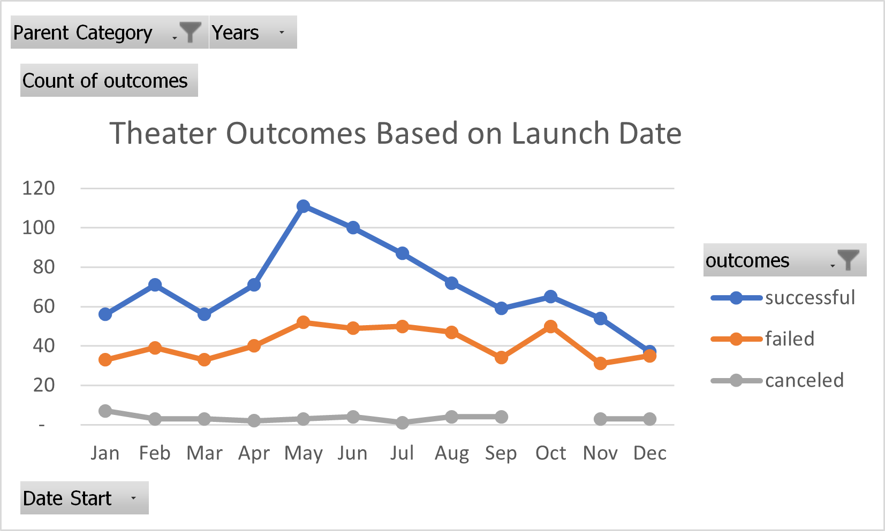
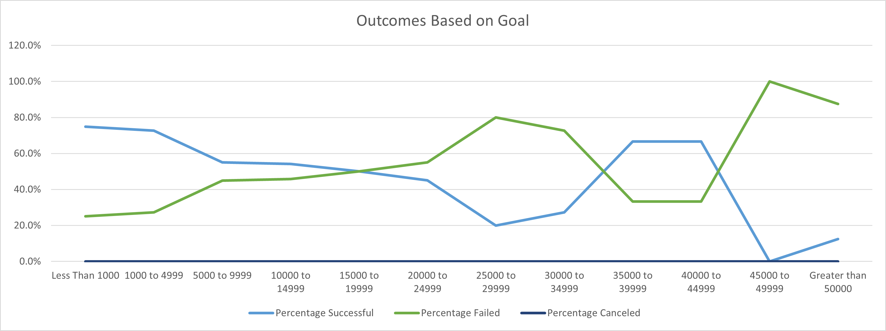

# Kickstarting with Excel
## Overview of Project
### Purpose
There were a few purposes to this project: 
1.	To evaluate/demonstrate my excel skills, which in turn was to create two analyses on outcomes based on goals and outcomes based on launch dates. 
2.	To help Louise understand how other campaigns fared in relation to their launch dates and their funding goals through visuals and data sets.
## Analysis and Challenges
  * I started my analysis by first eyeing up the dataset. This was a dataset we had been using in prior examples, but if this were the first time, I would have had to potentially clean up the data to make it workable.
  * When looking at “Theater Outcomes by Launch Date” tab – I simply pivoted the data out based on the specifications. In doing so, I could create a line graph which shows the flow of successful, failed, and canceled projected over the course of 12 months. Some difficulties or challenges that could be encountered is the grouping and ungroup of the “Date Start” – excel sometimes lumps quarters, years, and months together.

 * “Outcomes Based on Goals” tab – represents the outcome of “Plays” projects (successful, canceled, failed) based on the goal of the Kickstarter. Each projected was counted using a “COUNTIFS”. I used the “COUNTIFS” function and additional levers to create a seamless formula. I added the low and high points of each goal, as well as the text of successful, failed, and canceled. The formula below can be copied and dragged across without having the manually type. The challenges are trying to find a formula that flows rather than manually typing anything out.
COUNTIFS(Data!$F:$F,D$1,Data!$D:$D,">="&$A3,Data!$D:$D,"<="&$B3,Data!$R:$R,"Plays")
## Results:
### Analysis of Outcomes Based on Launch Date

### Analysis of Outcomes Based on Goals

## Results
### What are two conclusions you can draw about the Outcomes based on Launch Date?
 * Most successful months to launch were May & June
 * ~65-67% of the projects were successful in those months
 * The tail end of the year (October to December) see a steep decline in successful projects. If you combine failed and canceled slightly more than 50% of the projected did not succeed.

### What can you conclude about the Outcomes based on Goals?
 * When looking at the line graph we can clearly see three points of intersection.
 * Louise should focus her attention on those ranges which are above the points of intersection and that have the greatest count. The sweet spot seems to be $0 to $4,999 as that represents ~76% of successful projects in total.

### What are some limitations of this dataset?
 * If Louise is looking to set up a Kickstarter in 2021, the limitations would be that the data is stale. Historical trends are always great to look at, but fresh data can change your opinion very quickly.

### What are some other possible tables and/or graphs that we could create?
 * We could show some of the same effects from the “Theater Outcomes by Launch Date” in a stacked or clustered column chart – visually it shows a similar message.
 * “Outcomes Based on Goals” – we can change the goal range to hone in larger count of successful and failed projects. Smaller ranges may help Louise see a better assortment of projects

